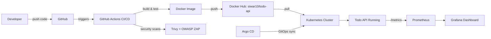
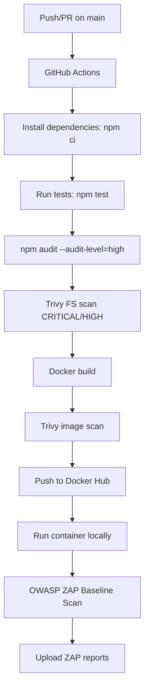
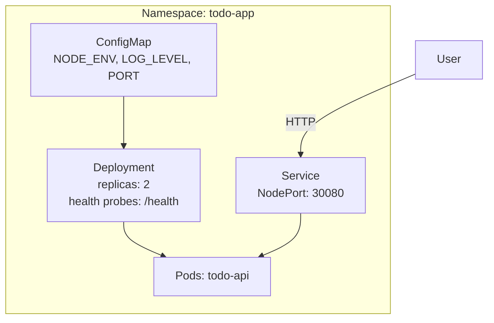
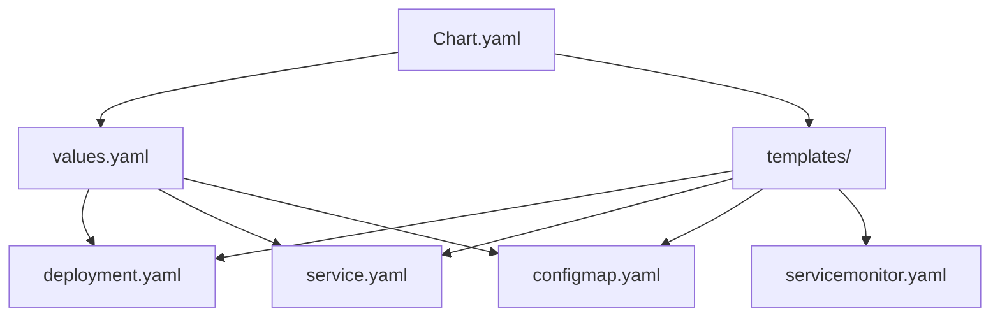
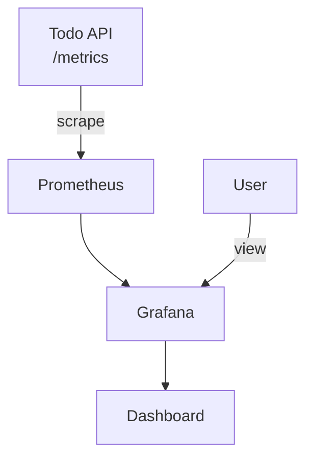

#  Todo API – DevSecOps Project

##  Project Overview

This project demonstrates a **complete end-to-end DevOps lifecycle** applied to a simple REST API called **Todo API**, developed in **Node.js (Express)**.

The goal is to show how **code → build → test → scan → deploy → monitor** are fully connected using modern DevOps tools and best practices.

---

##  Objectives

- Build a lightweight backend REST API (under 150 lines of code)
- Automate CI/CD with **GitHub Actions**
- Containerize with **Docker** and publish to **Docker Hub**
- Deploy on **Kubernetes** using manifests and **Helm Charts**
- Implement **GitOps** with **Argo CD**
- Add **observability**: metrics, structured logs, and tracing
- Integrate **DevSecOps**: SAST + DAST security scans
- Provide clear documentation and evidence

---

##  Technologies Used

| Category | Tools |
|----------|-------|
| **Backend** | Node.js, Express |
| **Testing** | Jest, Supertest |
| **Logging** | Winston (structured JSON logs) |
| **Metrics** | prom-client (`/metrics`) |
| **CI/CD** | GitHub Actions |
| **Container** | Docker, Docker Compose |
| **Security (SAST)** | npm audit, Trivy filesystem scan |
| **Security (DAST)** | OWASP ZAP Baseline Scan |
| **Orchestration** | Kubernetes (Minikube) |
| **Packaging** | Helm |
| **GitOps** | Argo CD |
| **Monitoring** | Prometheus, Grafana |

---

##  Architecture Overview

### High-Level Flow



### Components

- **Todo API**: Node.js REST service for managing todos
- **Docker Image**: Published to Docker Hub (`siwar10/todo-api:latest`)
- **Helm Chart**: Defines Deployment, Service, ConfigMap, ServiceMonitor
- **Argo CD**: Syncs Git repository state to Kubernetes cluster
- **Prometheus**: Scrapes `/metrics` endpoint
- **Grafana**: Visualizes metrics with custom dashboard

---

##  Repository Structure

```
todo-api/
├── .github/workflows/
│   └── ci.yml                    # CI/CD Pipeline
├── charts/todo-api/              # Helm Chart
│   ├── templates/
│   │   ├── deployment.yaml
│   │   ├── service.yaml
│   │   ├── configmap.yaml
│   │   └── servicemonitor.yaml
│   ├── Chart.yaml
│   └── values.yaml
├── k8s/                          # Kubernetes manifests
│   ├── namespace.yaml
│   ├── configmap.yaml
│   ├── deployment.yaml
│   └── service.yaml
├── monitoring/grafana/
│   └── todo-api-dashboard.json   # Grafana Dashboard
├── security/
│   ├── zap-scan.sh              # OWASP ZAP script
│   └── reports/                 # Security scan reports
├── src/
│   ├── app.js                   # Express API
│   └── logger.js                # Winston logger
├── tests/
│   └── api.test.js              # Jest tests
├── coverage/                     # Test coverage reports
├── Dockerfile
├── docker-compose.yml
└── package.json
```

---

##  API Endpoints

**Base URL**: `http://localhost:3000`

### Health & Metrics

| Endpoint | Method | Description |
|----------|--------|-------------|
| `/health` | GET | API health status |
| `/metrics` | GET | Prometheus metrics |

### Todos CRUD

| Endpoint | Method | Description |
|----------|--------|-------------|
| `/todos` | GET | Get all todos |
| `/todos/:id` | GET | Get todo by ID |
| `/todos` | POST | Create new todo |
| `/todos/:id` | PUT | Update todo |
| `/todos/:id` | DELETE | Delete todo |

### Example Usage

```bash
# Health check
curl http://localhost:3000/health

# Create a todo
curl -X POST http://localhost:3000/todos \
  -H "Content-Type: application/json" \
  -d '{"title":"Learn DevOps"}'

# Get all todos
curl http://localhost:3000/todos
```

---

##  Run Locally

### With Node.js

```bash
npm ci
npm test
npm start
# API available at: http://localhost:3000
```

### With Docker Compose

```bash
docker compose up --build
# API available at: http://localhost:3000
```

---

##  Testing & Coverage

Tests are executed locally and automatically in the CI pipeline.

```bash
npm test
```

### Test Coverage Results

```
PASS  tests/api.test.js
  ✓ GET /health → healthy status
  ✓ POST /todos → create todo
  ✓ GET /todos → list todos
  ✓ GET /todos/:id → get single todo
  ✓ PUT /todos/:id → update todo
  ✓ DELETE /todos/:id → delete todo
  ✓ GET /metrics → Prometheus metrics
```

Coverage reports available in `coverage/lcov-report/`

---

##  CI/CD Pipeline (GitHub Actions)

### Pipeline Stages



**Pipeline file**: `.github/workflows/ci.yml`

---

##  Security (DevSecOps)

### SAST (Static Application Security Testing)

- **npm audit**: `npm audit --audit-level=high`
- **Trivy FS scan**: Scans source code and dependencies

```bash
trivy fs . --severity CRITICAL,HIGH
```

### Container Image Scan

```bash
trivy image siwar10/todo-api:latest
```

### DAST (Dynamic Application Security Testing)

**OWASP ZAP Baseline Scan**:
- Target: `http://localhost:3000`
- Reports: HTML, JSON, Markdown
- Accessible via GitHub Actions artifacts

```bash
./security/zap-scan.sh
```

---

##  Kubernetes Deployment

### Namespaces

- `todo-app` → Application resources

### Deploy with Manifests

```bash
kubectl apply -f k8s/
kubectl get all -n todo-app
```

### Kubernetes Resources



### Access API

```bash
# Via NodePort
http://<node-ip>:30080

# Via port-forward
kubectl port-forward svc/todo-api-service -n todo-app 3000:80
```

---

##  Helm Chart

### Chart Structure



### Install with Helm

```bash
helm install todo-api charts/todo-api -n todo-app --create-namespace
```

### Upgrade

```bash
helm upgrade todo-api charts/todo-api -n todo-app
```

---

##  GitOps with Argo CD

Argo CD watches the GitHub repository and automatically syncs Kubernetes manifests to the cluster.


### Access Argo CD UI

```bash
kubectl port-forward svc/argocd-server -n argocd 8080:443
# URL: https://localhost:8080
```

Get admin password:

```bash
kubectl -n argocd get secret argocd-initial-admin-secret \
  -o jsonpath="{.data.password}" | base64 -d
```

---

##  Observability Stack

### Metrics

Exposed at `/metrics` using `prom-client`.

**Key metrics**:
- `http_requests_total`: Total HTTP requests by method, path, status
- `http_request_duration_seconds`: Request duration histogram



### ServiceMonitor

Prometheus discovers the API using a `ServiceMonitor`:

```yaml
endpoints:
  - port: http
    path: /metrics
    interval: 30s
```

### Grafana Dashboard

**Dashboard**: `monitoring/grafana/todo-api-dashboard.json`

**Panels**:
-  Requests Per Second (RPS)
-  Average Latency
-  HTTP Errors (4xx/5xx)
-  Top Endpoints

**Access Grafana**:

```bash
kubectl port-forward svc/monitoring-grafana -n monitoring 3001:80
# URL: http://localhost:3001
```

---

##  Logs & Correlation ID

### Structured Logs

Logs are structured using **Winston** in JSON format:

```json
{
  "timestamp": "2026-01-16T10:30:00.000Z",
  "correlationId": "abc123-xyz789",
  "message": "HTTP Request",
  "method": "POST",
  "path": "/todos",
  "status": 201
}
```

### Correlation ID

Each request includes a `X-Correlation-ID` header for tracing requests across logs and metrics.

---

##  Results Summary

- ✔ Backend API functional (under 150 lines)
- ✔ CI/CD pipeline automated and passing
- ✔ Docker image published to Docker Hub
- ✔ Security scans integrated (npm audit + Trivy + OWASP ZAP)
- ✔ Kubernetes deployment successful
- ✔ Helm chart packaged and deployed
- ✔ Argo CD GitOps synchronization
- ✔ Prometheus metrics exposed
- ✔ Grafana dashboard configured
- ✔ Structured logs with correlation IDs

---

##  Lessons Learned

- CI/CD automation significantly improves deployment speed and reliability
- Security must be integrated early in the pipeline (Shift Left approach)
- GitOps with Argo CD simplifies deployment management
- Observability (metrics, logs, tracing) is essential for debugging and monitoring
- Helm charts bring consistency and reusability to Kubernetes deployments
- DevOps is about **automation, visibility, and continuous improvement**

---

##  Future Improvements

- [ ] Add Prometheus alerting rules (Alertmanager)
- [ ] Implement NGINX Ingress with custom domain
- [ ] Add rate limiting and JWT authentication
- [ ] Integrate OpenTelemetry distributed tracing
- [ ] Deploy to cloud Kubernetes (EKS/GKE/AKS)
- [ ] Add database persistence (PostgreSQL/MongoDB)
- [ ] Implement horizontal pod autoscaling (HPA)

---

##  Author

**Siwar Ghlissi**  
DevOps / DevSecOps Individual Project

**Repository**: `Todo-app`  
**Docker Hub**: [`siwar10/todo-api`](https://hub.docker.com/r/siwar10/todo-api)


---

**⭐ If you find this project helpful, please give it a star!**
